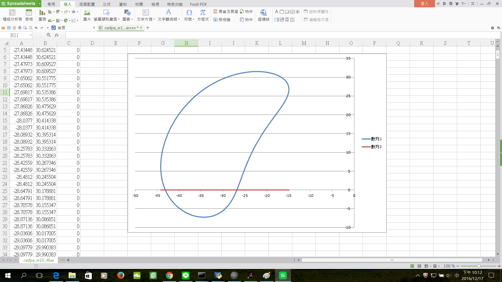

Title: Week 10
Date: 2016-11-18 22:00
Category: Misc
Tags: Solvespace
Author: 40423249

上課內容

<!-- PELICAN_END_SUMMARY -->

有關 Solvespace 機構模擬功能介紹, 與 Python3 及 Brython 程式驗證

路徑圖

將所得到的點座標 .csv 以 Excel 畫圖。路徑圖

影片

<iframe src="https://player.vimeo.com/video/198369023" width="640" height="480" frameborder="0" webkitallowfullscreen mozallowfullscreen allowfullscreen></iframe>

<a href="https://vimeo.com/user61519433">個人影片區</a>

心得

期中考剛考完，放送了一下，又繼續開始上課了，今天是第十次上課，這次上課開始教畫圖，這次教的是Solvespace，因為大部分都是英文，剛好可以藉此練習英文 。我這次做的時候也出現了許多問題，一開始有問題要快點解決，不然會牽連到之後，慶幸的是有些同學可以教我，讓我學得比較輕鬆一點，不過我們經過討論才知道大家還是有彼此不熟得地方，希望可以藉由之後的上課，一一克服。
