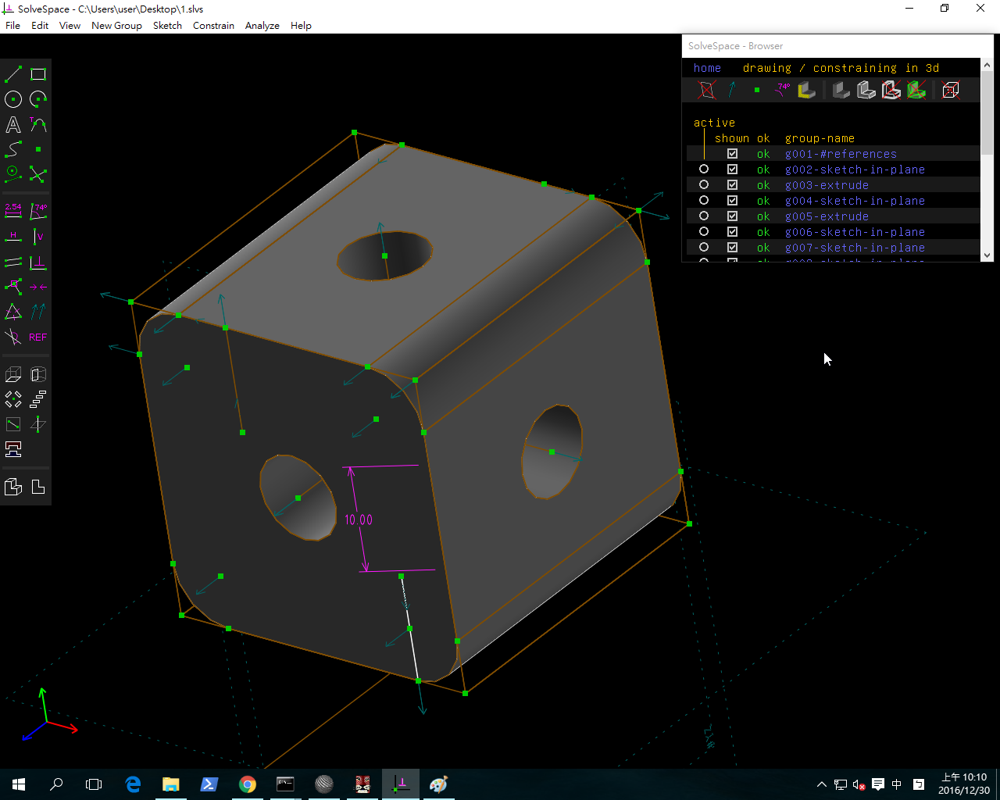
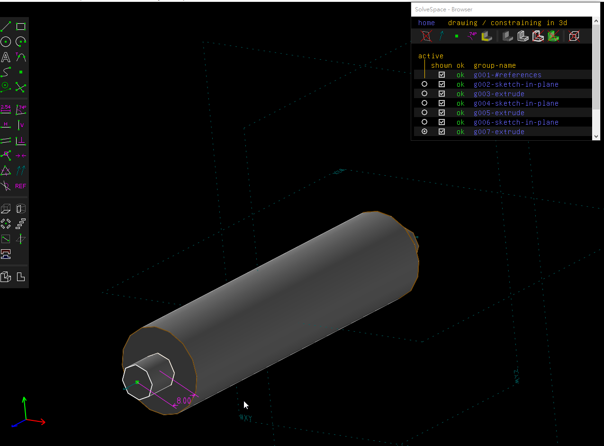
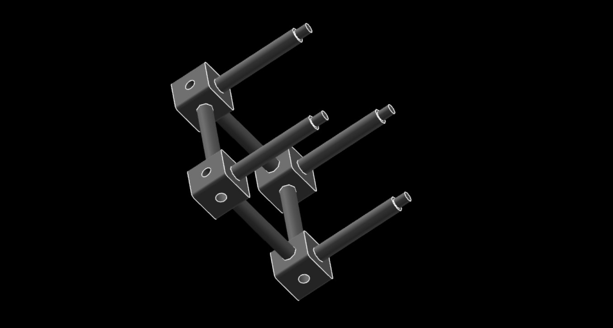

Title: Week 12
Date: 2016-12-02 22:00
Category: Misc
Tags: Solvespace(2)
Author: 40423249

上課內容

<!-- PELICAN_END_SUMMARY -->

利用SOLVESPACE練習繪製COLLEGE_STUDENT_PRIMER_CREO_2.PDF裡的零件並學習如何組立。

影片

<iframe src="https://player.vimeo.com/video/199450377" width="640" height="450" frameborder="0" webkitallowfullscreen mozallowfullscreen allowfullscreen></iframe>

<iframe src="https://player.vimeo.com/video/199451073" width="640" height="450" frameborder="0" webkitallowfullscreen mozallowfullscreen allowfullscreen></iframe>

<iframe src="https://player.vimeo.com/video/199453007" width="640" height="450" frameborder="0" webkitallowfullscreen mozallowfullscreen allowfullscreen></iframe>

<a href="https://vimeo.com/user61519433">個人影片區</a>

心得

今天第十二次上課，要畫第二張圖，還不是很習慣用這個軟體，但是還是有它好用的地方，希望之後可以好好練習，弄熟這套不錯的軟體。

