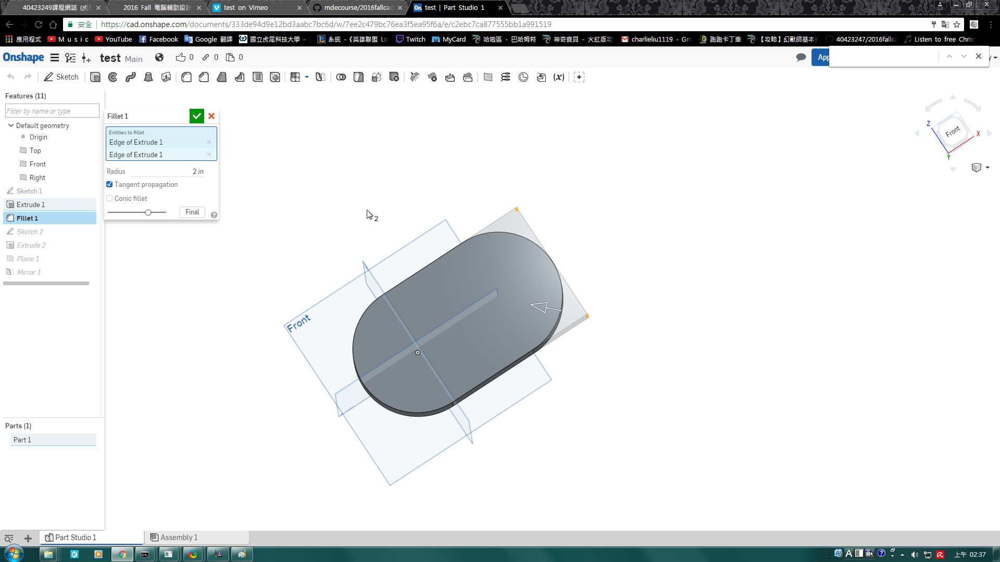
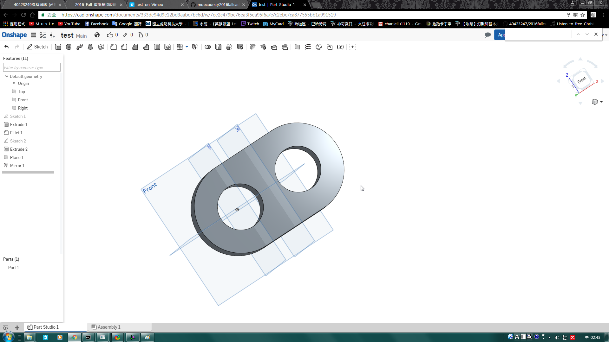

Title: Week 13
Date: 2016-12-09 22:00
Category: Misc
Tags: OnShape(1)
Author: 40423249

上課內容

<!-- PELICAN_END_SUMMARY -->

利用OnShape練習繪製零件。

影片

<iframe src="https://player.vimeo.com/video/198373370" width="640" height="480" frameborder="0" webkitallowfullscreen mozallowfullscreen allowfullscreen></iframe>

<a href="https://vimeo.com/user60053503">個人影片區</a>

心得

今天第十三次上課，又交一個新的軟體OnShape，辦會員的時候很好玩，我還把名字取的很好笑，不過雖然這個軟體可以中文化，但是老師叫我們練習英文，所以用英文版的，慢慢練習囉!

