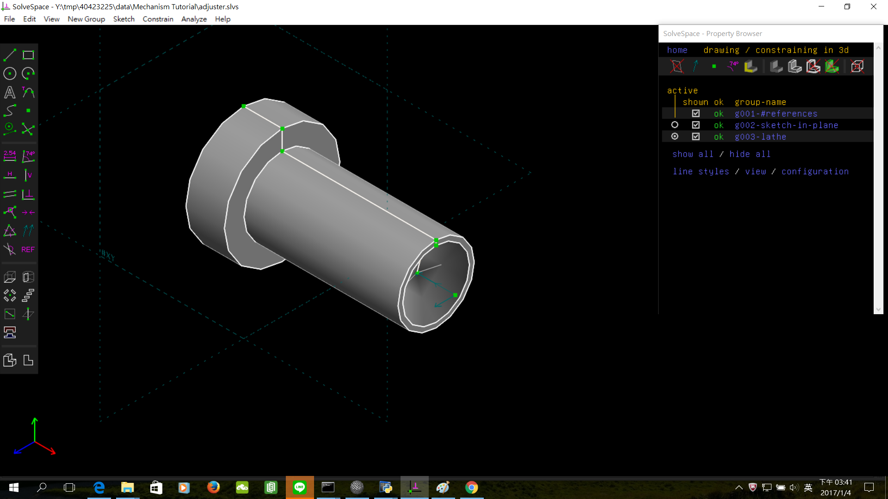
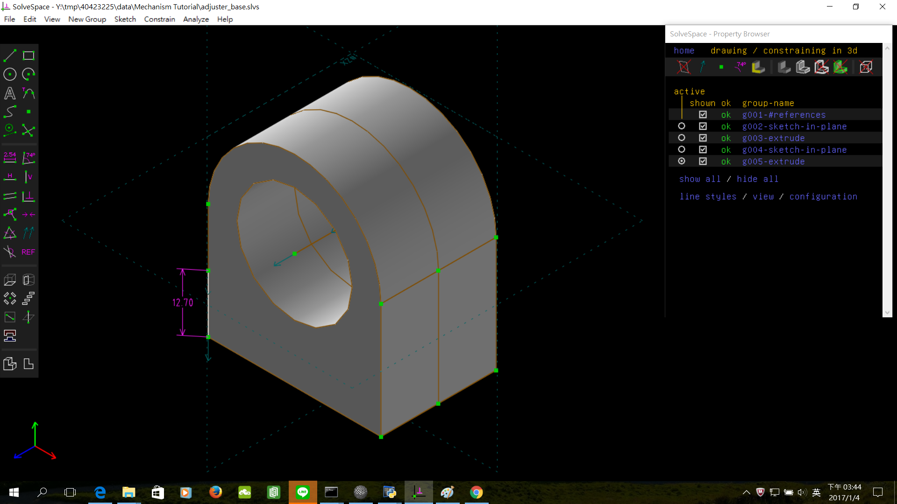
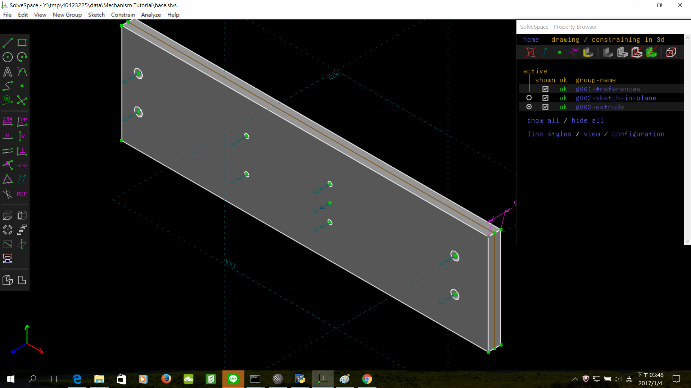
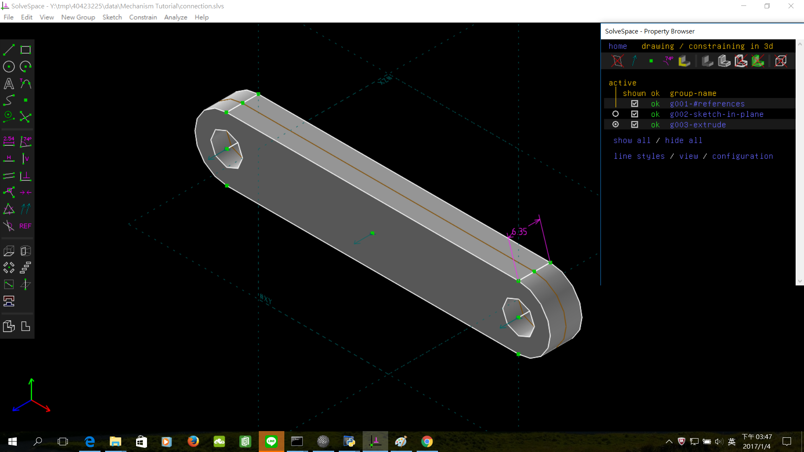
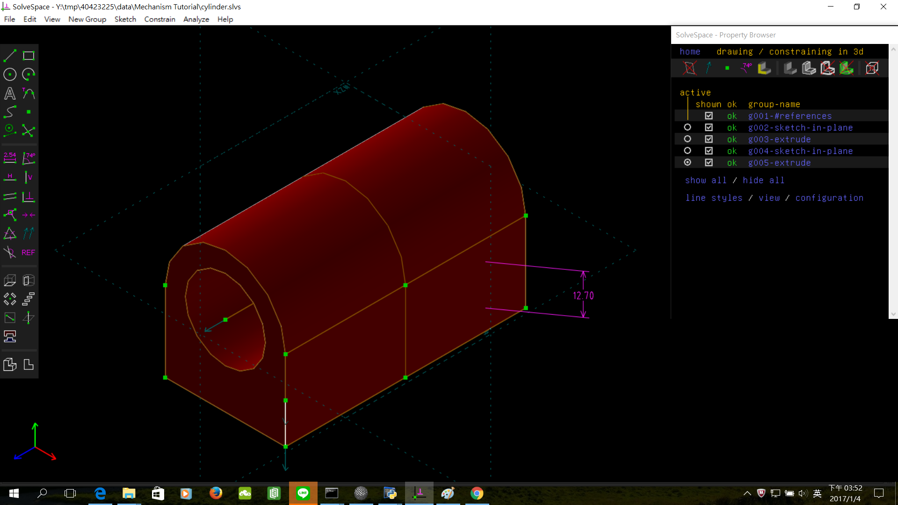
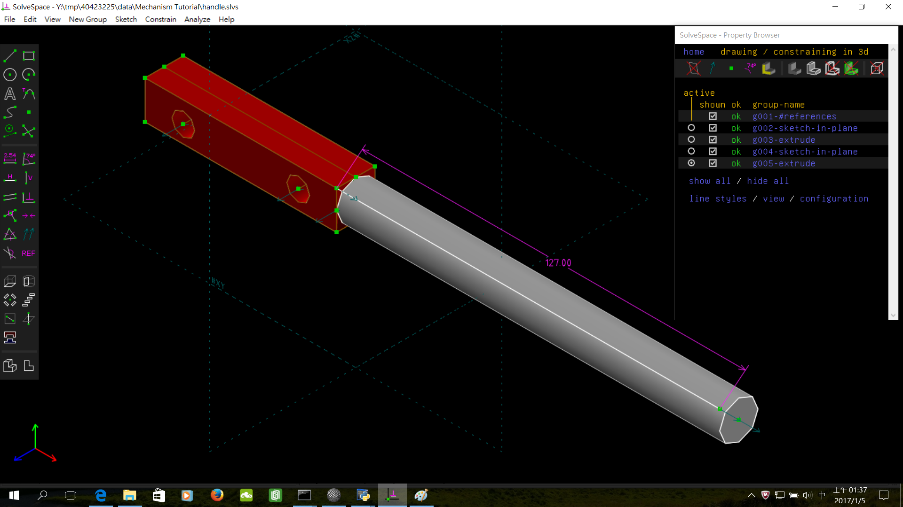
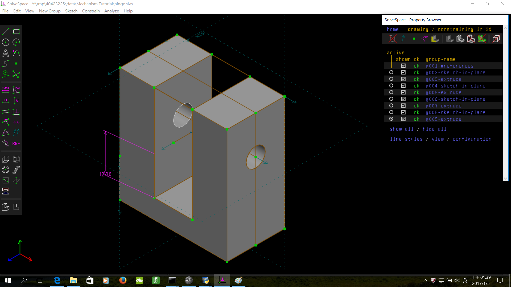
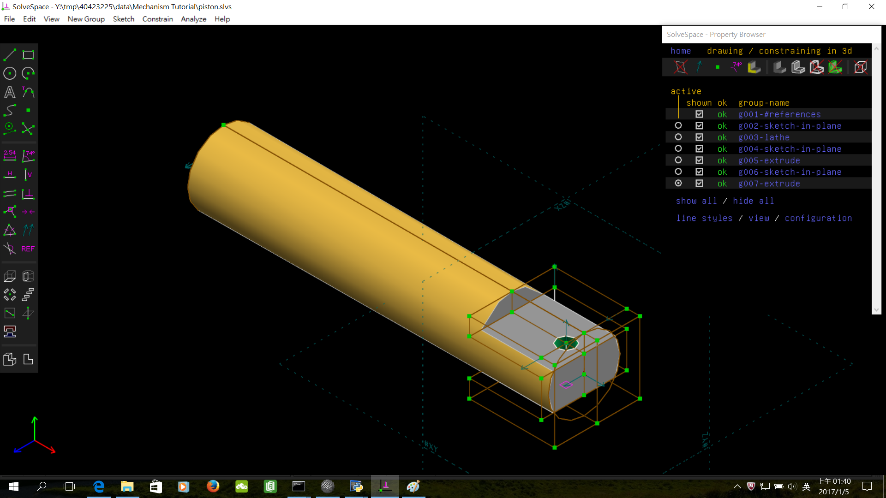

Title: Week 16
Date: 2016-12-30 22:00
Category: Misc
Tags: OnShape(2)
Author: 40423249

上課內容

<!-- PELICAN_END_SUMMARY -->

OnShape繪製Mechanism Tutorial

<iframe src="./../data/image/W16-1.html" width="800"  height="800"/></iframe>

零件

<iframe src="./../data/image/W16-2.html" width="800"  height="800"/></iframe>

<iframe src="./../data/image/W16-3.html" width="800"  height="800"/></iframe>

<iframe src="./../data/image/W16-4.html" width="800"  height="800"/></iframe>

<iframe src="./../data/image/W16-5.html" width="800"  height="800"/></iframe>

<iframe src="./../data/image/W16-6.html" width="800"  height="800"/></iframe>

<iframe src="./../data/image/W16-7.html" width="800"  height="800"/></iframe>

<iframe src="./../data/image/W16-8.html" width="800"  height="800"/></iframe>

<iframe src="./../data/image/W16-9.html" width="800"  height="800"/></iframe>

影片

<iframe src="https://player.vimeo.com/video/198434975" width="640" height="480" frameborder="0" webkitallowfullscreen mozallowfullscreen allowfullscreen></iframe>

<a href="https://vimeo.com/user61519433">個人影片區</a>

心得

今天第十六次上課，又回到OnShape了，這次上課因為是元旦前一天.，所以蠻多人沒來上課，跑去跨年，剩沒幾個人留下來畫圖，看來又是個好機會了。

