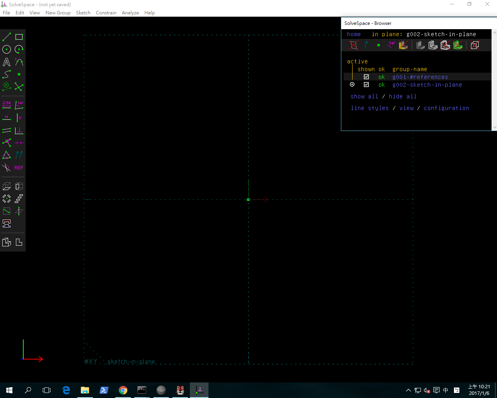
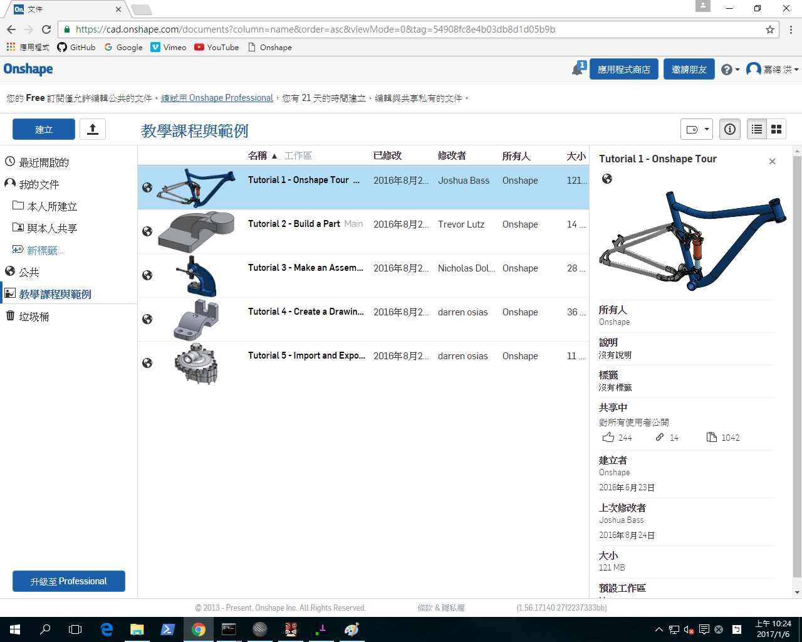

Title: 第十七週
Date: 2017-01-06 22:00
Category: Misc
Tags: 總整理
Author: 40423249

最後整理上課內容

<!-- PELICAN_END_SUMMARY -->

Solvespace

OnShape

<a href="https://vimeo.com/user61519433">個人影片區</a>

心得

今天是第十七次上課，終於到了最後的幾堂課了，很開心學到了OnShape跟Solvespace，雖然還不算是整個學會，但至少有了解到許多的操作跟一點點的概念，雖然不知道之後還會不會再遇到這個軟體，不過以備不時之需。下禮拜期末考，要好好加油了。

